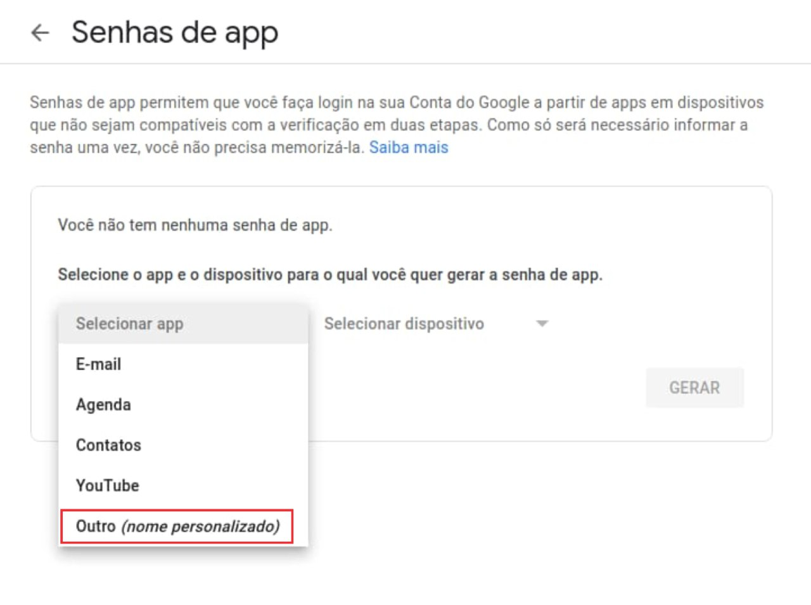
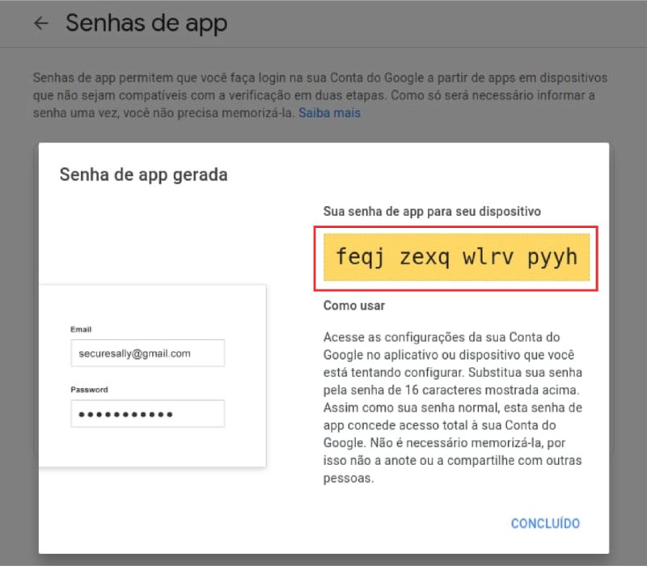
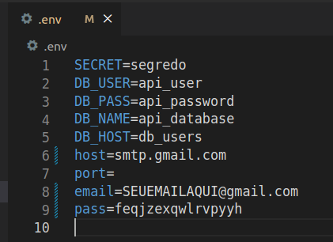
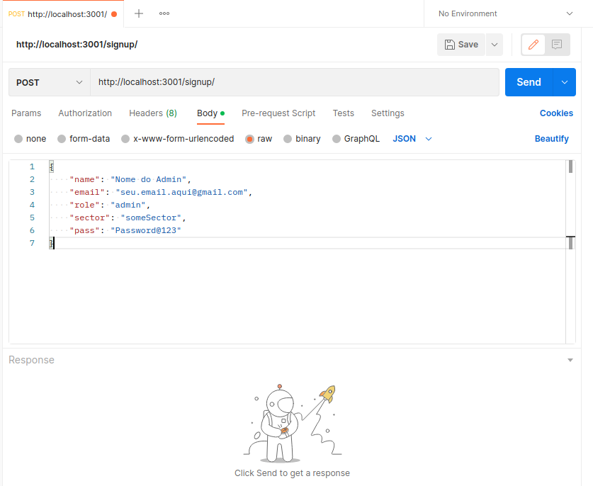
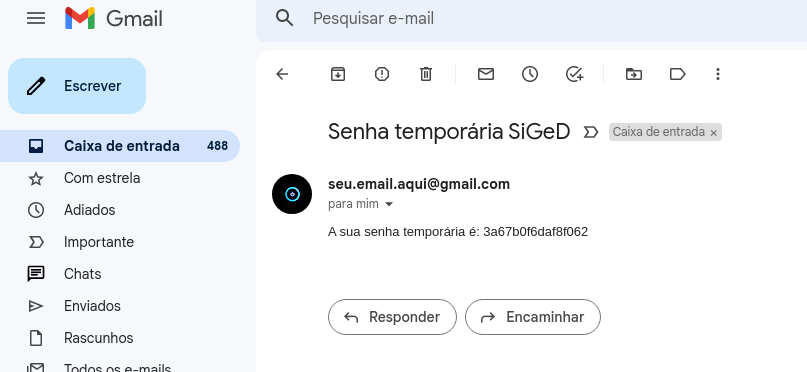
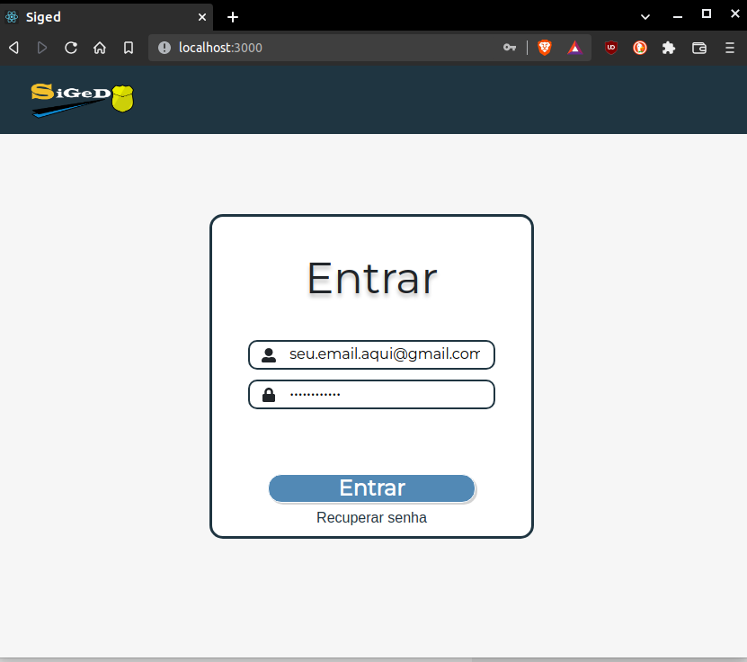
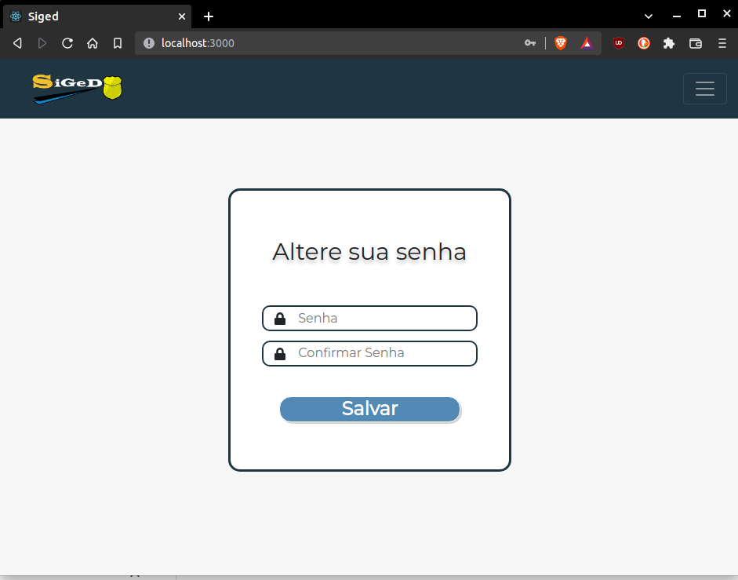
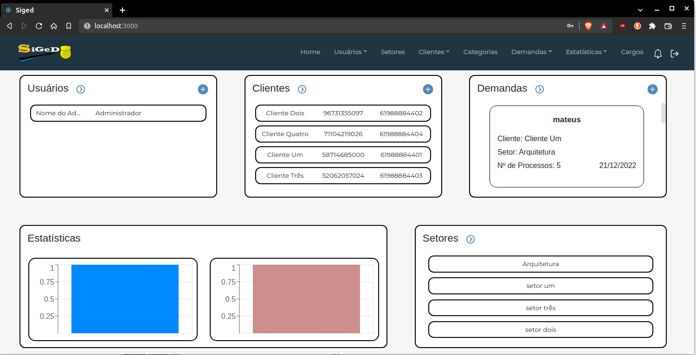

<h1 style='text-align: center;'>Entrar no ambiente localmente</h1>

## Introdução

Este guia tem como objetivo auxiliar novos desenvolvedores a entrarem pela primeira vez na aplicação completa localmente, trazendo o passo a passo para lidar com o login temporário que a aplicação possui.

## Cadastro de novo usuário

Para realizar o login, é preciso que você tenha um servidor de e-mail ativo, nesse guia utilizaremos
o gmail da Google. A aplicação utiliza o nodemailer, portanto para cadastrar um novo usuário você deve seguir os passos a seguir.

### Criação de senha de aplicativo 
Você deve criar uma senha de aplicativo utilizando o link abaixo para poder enviar as credenciais para si mesmo.

[Senhas de app](https://myaccount.google.com/u/2/apppasswords)

- Passo 1
Ao entrar no link, o primeiro passo a fazer é selecionar o aplicativo e o dispositivo para o qual deseja gerar a senha como "Outro", mostrado na imagem abaixo.


- Passo 2
Em seguida digite "Siged" como seu aplicatio e gere a senha, como mostra a imagem abaixo.


- Passo 3
Por fim, a senha da aplicação para seu dispositivo será gerada, como mostra na imagem abaixo. Faça uma cópia dessa senha e coloque em "pass=" no arquivo .env.



### Configuração do arquivo .env
O seu arquivo .env deve se parecer com isso após completar os passos.



Após a configuração do arquivo .env, suba o ambiente seguindo o <a href="https://github.com/DITGO/2021-2-SiGeD-Doc/blob/main/docs/subindo_projeto.md">tutorial</a> criado para auxílio.

### Após subir o ambiente

Utilize o link <a href="http://localhost:3001/signup/">http://localhost:3001/signup/</a> em alguma ferramenta que permita testes de api, como o `insomnia` ou o `postman` e utilize o corpo em JSON abaixo e o verbo POST para cadastrar o novo usuário. 

>POST

```JSON
{
    "name": "Nome do Admin",
    "email": "seu.email.aqui@gmail.com",
    "role": "admin",
    "sector": "someSector",
    "pass": "Password@123"
}
```
*Modifique os campos `name:`, `email:` e `pass:`.*

O seu aplicativo deve se parecer com isso agora:



Após enviar a requisição verifique seu email Google, a senha temporária terá sido enviada para lá.



## Logando na aplicação

Utilize seu e-mail cadastrado e a senha temporária enviada para ele para entrar na aplicação. 



Após isso, o sistema pedirá de imediato que você altere sua senha temporária para uma definitiva, altere-a. 



Fazendo essa alteração, você consegue entrar no sistema e ter acesso aos seus serviços, como mostrado abaixo.



## Observação

Caso tenha enviado por engano a senha temporária sem configurar primeiro o arquivo `.env` utilize o comando `docker-compose down -v` para limpar o banco de dados e refazer as etapas anteriores corretamente.